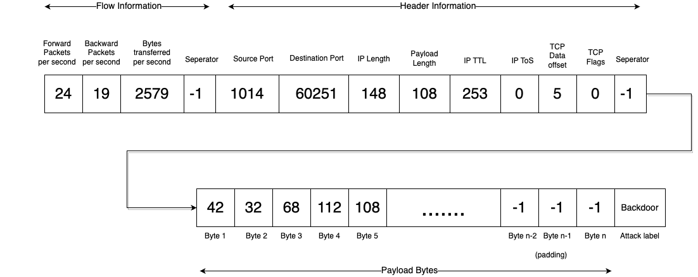
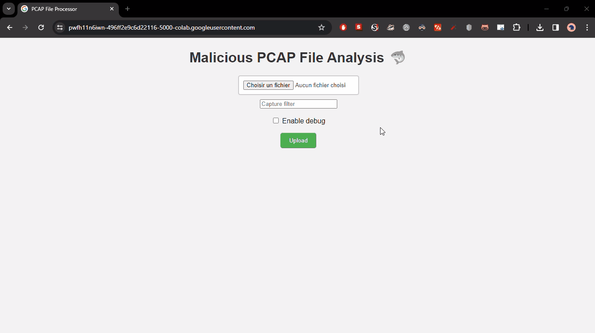

<h1>ESIR-S9 - AI Project : Network Traffic Analysis</h1>
<b>Yazid BENJAMAA <a href="https://github.com/Xacone">(@Xacone)</a> & Thomas DELAPART <a href="https://github.com/Thomega35">(@Thomega35)</a></b>
<br><br>
The project's purpose is to predict wether a network activiy is malicious or not, this classification is achieved by analysis each packet content and context in a network capture file (pcap) and then returning a brief of the attacks that were detected.
<br><br>We also built a little Flask web app which has Google Colab as a backend that allows to visualiaze classification results, more details below.

<h3>Model and input format</h3>

We took the following model from HuggingFace : <a href="https://huggingface.co/rdpahalavan/bert-network-packet-flow-header-payload">rdpahalavan/bert-network-packet-flow-header-payload</a> which classifies a <b>single network packet</b> into one of these categories : 
```
['Analysis', 'Backdoor', 'Bot', 'DDoS', 'DoS', 'DoS GoldenEye', 'DoS Hulk', 'DoS SlowHTTPTest', 'DoS Slowloris', 'Exploits', 'FTP Patator', 'Fuzzers', 'Generic', 'Heartbleed', 'Infiltration', 'Normal', 'Port Scan', 'Reconnaissance', 'SSH Patator', 'Shellcode', 'Web Attack - Brute Force', 'Web Attack - SQL Injection', 'Web Attack - XSS', 'Worms']
```

Each input represents a network packet which respects the following structure :
<br><br>


Each IP packet in a a loaded pcap file is converted to the format before being processed by the model, pcap/packets manipulation is done using <a href="https://scapy.net/">Scapy</a>

<h3>Fine-tuning</h3>

There was many attempts to fine-tune the model. When adding more training labeled samples, the model has been much more proficient in detecting the same attack or attacks of the same family (acting at the same TCP/IP layer) but it returned inconsistent and false results for the other attacks, either detecting nothing at all or a bunch of other attacks that had nothing to do with the content of the pcap file. Knowng that we have also filtered packets that were taken into account during training (e.g. only `GET` or `POST` requests for HTTP DoS attack samples). 

The notebook provides the function `trainFromPcapFile(file_path, label, application_filter)` which allow to add transformed training samples (packets) retrieved from a pcap file + the ability to select packets based on filter patterns.  
```python
trainFromPcapFile("/content/sample_data/dvwa_sql_injection.pcap", 21, b"GET /") # Transforming and adding packets from the pcap file + labelize them with 21 (Web Attack - SQL Injection) + taking only GET requests.
```

We also tried to get rid of certain parameters such as the backward and forward packets (which seemed to us to be irrelevant in a normal packet capture sequence) which also ameloried the results of some attacks detection such as web attacks and port scans but which also proved to distort certain results
We aren't able to provide a stable statement on the efficiency of fine-tuning , however we truly believe that more efforts and testings could lead to a more performant and balanced fine-tuned model.

<h3>Detecting Applicative (Layer 7) Denial of Service Attacks & Used Tools</h3>

The model does such a great job in detecting DoS attacks through the network. <br>
Two HTTP Simple Denial of Service (DoS) tools were used to test its capabilites at detecting attacks that emanate from them : 
<a href="https://github.com/grafov/hulk"> Hulk </a> & <a href="https://www.kali.org/tools/goldeneye/"> GoldenEye </a>

<h4>Hulk</h4>


<h4>20 ports TCP SYN Scannning (Assimiled to a normal activity)</h4>



<h3>How to set up the app on Google Collab </h3>

Once executed, the following cell will print a link which will be routing to the app :

```python
from google.colab.output import eval_js
print(eval_js("google.colab.kernel.proxyPort(5000)"))
```

Then execute the next cell that will fire up the backend, it is a flask-based application w/ two endpoints
```python
[....]

@app.route("/")
def home():
    return index

@app.route('/upload', methods=['POST'])
def upload_file():

[...]

if __name__ == "__main__":
    app.run()
[....]
```

Then click the link, you should land on the following app : 

<br><br>

The given notebook allows to use Colab's default GPU w/ Pytorch in order to make trainings/predictions faster :

```python
device = torch.device("cuda:0" if torch.cuda.is_available() else "cpu")
model = model.to(device)
```


